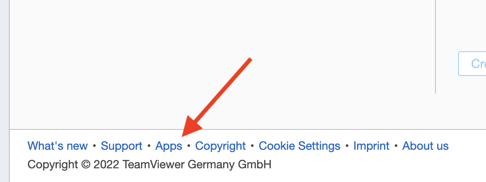
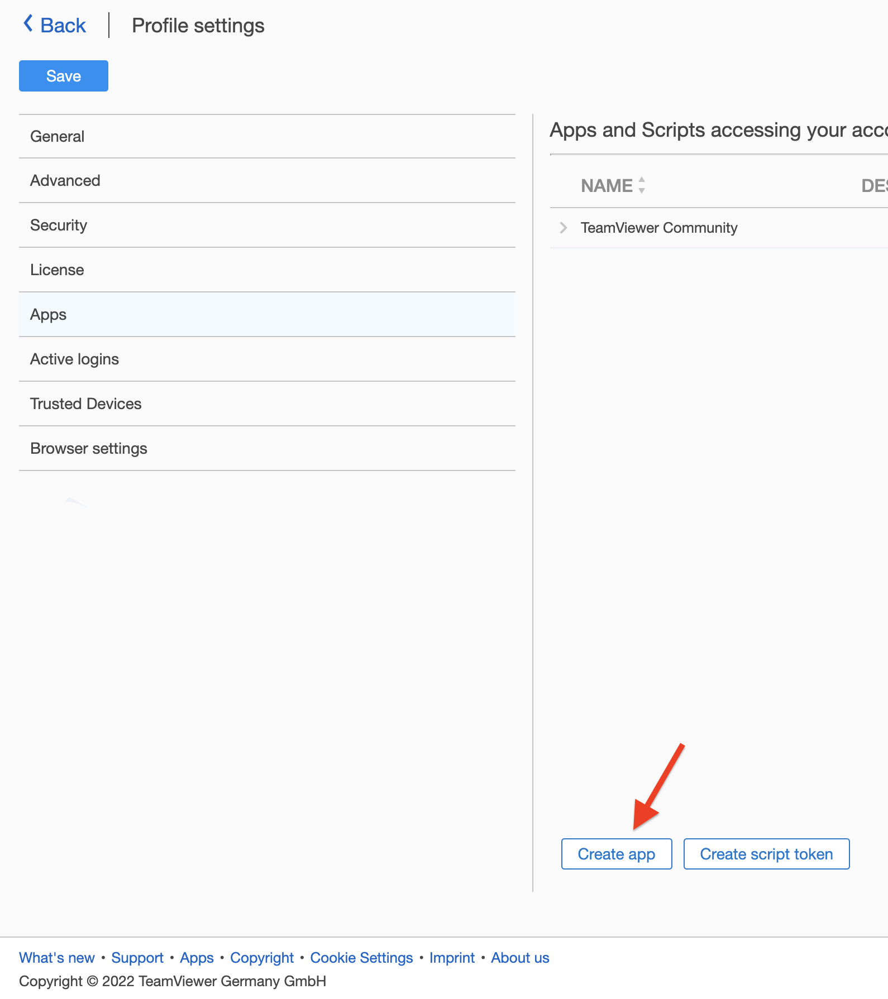
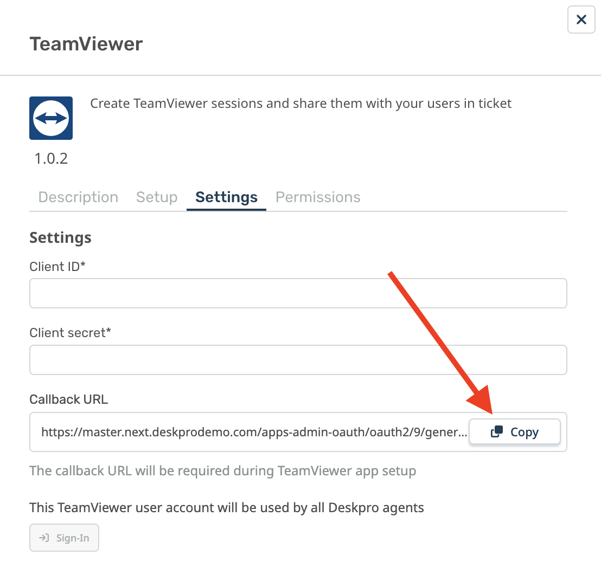
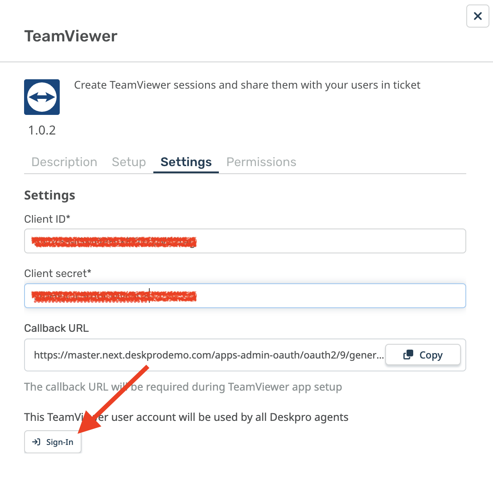

TeamViewer App Setup
===

To install the TeamViewer App you must first add the app to TeamViewer itself. Head over to TeamViewer [https://login.teamviewer.com](https://login.teamviewer.com) and sign in.

In the Console, open the Apps link in the footer of the website.

Click "Create App"

Next, head back to Deskpro and navigate to **Admin > Apps & Integrations > Apps**.

Click on the "Available Apps" tab and select the TeamViewer app to install it. Navigate to the "Settings" tab of the app and copy the "Callback URL" to your clipboard.

Ok, head back to TeamViewer Management Console and enter the following details into the new app form:

* **Name:** "Deskpro App"
* **Redirect URI:** Enter the callback URl that you copied from Deskpro
* Choose permissions:
  * __Account management__: view account data,
  * __User management__: view users,
  * __Session management__: view own sessions, view all sessions, edit own sessions, edit all sessions of the company, create sessions

Then click "Create"

After that, we will see the created application. Copy the "Client ID" and "Client secret" and keep them safe.

Next, head back to Deskpro and enter the Client ID and Secret into the app settings form.

Next, click "Sign-in". Please note that this is the user that the Deskpro TeamViewer app will use to request details from TeamViewer for any Deskpro agent.

Once you've authorized your global TeamViewer user, click the "Install" button at the bottom of the screen.
